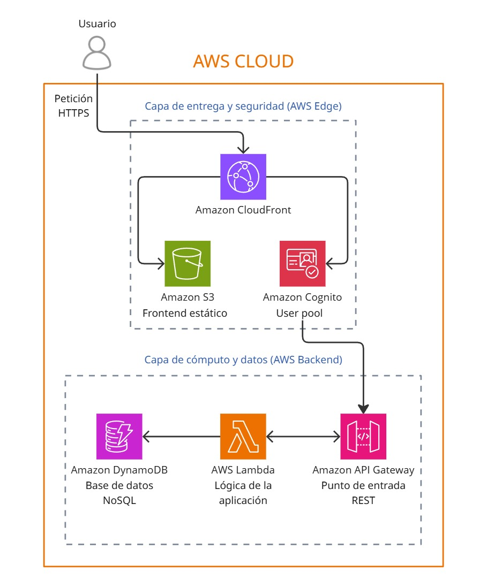

# Aplicación Web Serverless de Gestión de Tareas

Proyecto final para el curso de Computación en la Nube. El objetivo es diseñar, desarrollar y desplegar una aplicación web completa de tipo "To-Do List" utilizando una arquitectura 100% serverless en Amazon Web Services (AWS).

## Descripción del Proyecto
Esta aplicación permite a los usuarios registrarse, iniciar sesión de forma segura y gestionar sus propias listas de tareas. Cada usuario tiene acceso únicamente a sus datos, garantizando la privacidad y el aislamiento. El proyecto abarca todo el ciclo de vida del desarrollo de software en la nube, desde el diseño de la arquitectura y la implementación del frontend y backend, hasta el despliegue automatizado y la configuración de buenas prácticas de seguridad y monitoreo.
El enfoque principal es demostrar la eficiencia, escalabilidad y rentabilidad de las arquitecturas serverless para construir aplicaciones web modernas.
## Funcionalidades Clave

Más allá de un CRUD básico, esta aplicación implementa patrones de diseño avanzados:

- **🔐 Autenticación Robusta:** Registro, Login y Recuperación de contraseña con Amazon Cognito (MFA opcional).
- **🔎 Búsqueda Full-Text:** Sistema de búsqueda inteligente para localizar tareas por título o descripción en tiempo real.
- **📄 Paginación Eficiente:** Manejo de grandes volúmenes de datos cargando tareas por segmentos para optimizar la latencia y el consumo de red.
- **🏷️ Clasificación por Prioridad:** Organización visual de tareas (Alta, Media, Baja) para gestión efectiva del tiempo.
- **⚡ Rendimiento Optimizado:** Uso de CloudFront como CDN para entregar la interfaz en milisegundos a nivel global.
## Galería

| 🏠 Dashboard Principal | 🔍 Búsqueda en Tiempo Real | ⚡ Clasificación por Prioridad |
|:---:|:---:|:---:|
|  |  |  |
| *Vista general de tareas* | *Filtrado instantáneo* | *Organización visual* |
## Arquitectura Tecnológica
La solución se basa en un stack tecnológico serverless nativo de AWS, desacoplando el frontend del backend para maximizar la flexibilidad y la escalabilidad.
### Stack Tecnológico
- **Frontend:** React.js
- **Backend:** Node.js (Funciones AWS Lambda)
- **Infraestructura como Código (IaC):** AWS SAM (Serverless Application Model)
- **Plataforma Cloud:** Amazon Web Services (AWS)
### Servicios Clave de AWS
- **Hosting y Distribución:**
    - **Amazon S3:** Alojamiento de los archivos estáticos del frontend.
    - **Amazon CloudFront:** CDN para entrega de contenido rápida y segura (HTTPS).
- **Cómputo (Backend):**
    - **AWS Lambda:** Ejecución de la lógica de negocio sin gestionar servidores.
- **API y Autenticación:**
    - **Amazon API Gateway:** Exposición de las funciones Lambda como una API RESTful segura.
    - **Amazon Cognito:** Gestión completa del ciclo de vida de usuarios (registro, login, JWT).
- **Base de Datos:**
    - **Amazon DynamoDB:** Base de datos NoSQL, serverless y de alto rendimiento.
### Diagrama de arquitectura

  

 

## Referencia de API

La comunicación entre el Frontend y el Backend se realiza a través de una API REST protegida.

| Método | Endpoint | Descripción | Requiere Auth |
| :--- | :--- | :--- | :---: |
| `GET` | `/tasks` | Obtiene la lista de tareas (soporta `?limit=10&next=...` para paginación). | ✅ |
| `POST` | `/tasks` | Crea una nueva tarea. Body: `{ title, description, priority }`. | ✅ |
| `GET` | `/search` | Busca tareas. Ejemplo: `/search?q=comprar`. | ✅ |
| `PUT` | `/tasks/{id}` | Actualiza el estado o contenido de una tarea específica. | ✅ |
| `DELETE`| `/tasks/{id}` | Elimina una tarea permanentemente. | ✅ |
---

## Decisiones Técnicas y Retos

### Implementación de Búsqueda
Para lograr la búsqueda de texto sin levantar servidores costosos como OpenSearch, implementamos [Explica aquí tu solución, ej: un filtro en Lambda o DynamoDB Streams]. Esto mantuvo el costo bajo sin sacrificar la funcionalidad.

### Estrategia de Paginación
En lugar de traer todas las tareas (que sería lento y costoso), implementamos paginación basada en cursor (`LastEvaluatedKey` de DynamoDB), lo que garantiza tiempos de respuesta constantes sin importar si el usuario tiene 10 o 10,000 tareas.

## Autores

- **Melissa Franco Bernal** - [GitHub: mefrancob](https://github.com/mefrancob)
- **Manuel Tomás Rivera Portilla** - [GitHub: mariverapo](https://github.com/mariverapo)
